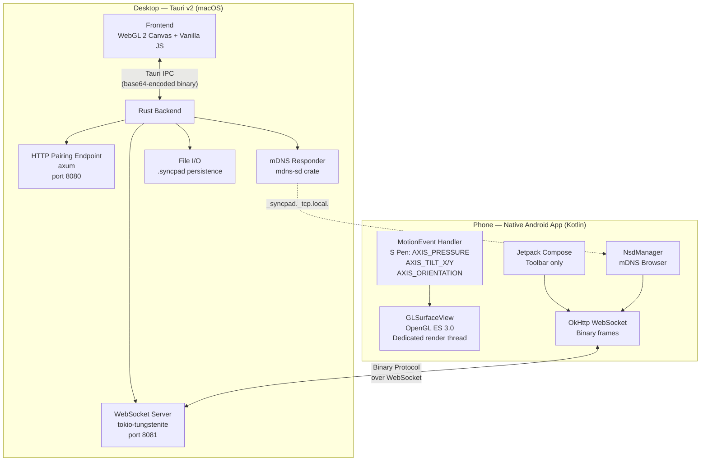

# SyncPad — Architecture Document (Revised)

Split-screen note-taking: Samsung S23 Ultra (S Pen input via native Android app) ↔ Mac desktop (full canvas viewer via Tauri). The desktop shows the full A4 page with a draggable viewport box; the phone shows the zoomed content inside that box. Strokes flow in real-time over LAN.

## System Diagram



## Technology Stack

| Component | Choice |
|:--|:--|
| Desktop app | Tauri v2 (Rust backend + system webview) |
| Desktop rendering | WebGL 2, vanilla JS, no framework |
| Phone app | Native Android (Kotlin), min SDK 28 |
| Phone rendering | GLSurfaceView + OpenGL ES 3.0 |
| Phone input | MotionEvent API (raw S Pen axes) |
| Phone UI chrome | Jetpack Compose (toolbar only) |
| Phone WebSocket | OkHttp WebSocket client |
| Phone discovery | Android NsdManager (mDNS browser) |
| Transport | WebSocket (TCP), binary frames |
| Wire format | Custom packed binary (hot path), MessagePack (control msgs) |
| Stroke geometry | Tessellation: point array → outline polygon → triangle strip |
| Persistence | Custom binary `.syncpad` format |
| Coordinate system | Millimeters (A4 = 210×297mm), DPR-aware rendering |

## What Changed (vs. Previous Plan)

| Before | After | Why |
|:--|:--|:--|
| Phone = browser page served by desktop HTTP | Phone = native Android app (Kotlin) | Direct MotionEvent API for raw S Pen data; dedicated GL render thread; no browser gesture interception |
| HTTP server serves phone client + pairing | HTTP server serves pairing endpoint only | Phone client is now an APK, not a web page |
| Shared JS rendering engine (symlinked) | Parallel implementations: WebGL/JS (desktop) + OpenGL ES/GLSL (Android) | No code sharing possible across web/native — same spec, different codebases |
| PointerEvent API for pressure/tilt | MotionEvent AXIS_PRESSURE/TILT_X/TILT_Y/ORIENTATION | Native API gives reliable, high-frequency stylus data |
| `touch-action: none` CSS hacks | MotionEvent `pointerType` discrimination in native code | Clean input separation: S Pen vs finger vs palm |

## Component Details

### Desktop (Tauri v2)

**Rust backend** (`src-tauri/src/`):
- `lib.rs` — Tauri setup, IPC commands, spawns servers
- `ws_server.rs` — WebSocket server (tokio-tungstenite), handles Android client connections
- `http_server.rs` — Minimal axum server: pairing QR endpoint only
- `protocol.rs` — Binary protocol encode/decode (shared types with Android via spec, not shared code)
- `state.rs` — In-memory notebook state, stroke storage, undo/redo, viewport, connection tracking
- `mdns.rs` — Register `_syncpad._tcp.local.` on LAN
- `pairing.rs` — Token generation, QR code, device memory, HMAC auth
- `notebook.rs` — .syncpad file format read/write, auto-save

**Frontend** (`src/`):
- `index.html` — Single canvas + toolbar overlay
- `main.js` — Entry point, Tauri IPC, input handling (quick annotation mode)
- `style.css` — Dark theme
- `lib/renderer.js` — WebGL 2 stroke renderer (dual VBO architecture)
- `lib/stroke-model.js` — Stroke/Page/Notebook data structures, undo/redo logic
- `lib/viewport.js` — Viewport box model, mm↔screen coordinate transforms
- `lib/protocol.js` — Binary protocol encode/decode (JS, mirrors Rust exactly)

### Phone (Android)

**Android project** (`android/`):
- Standard Gradle project, Kotlin, min SDK 28, target SDK 34
- `app/src/main/java/.../`
  - `MainActivity.kt` — Compose activity, hosts GLSurfaceView + toolbar
  - `renderer/SyncPadRenderer.kt` — GLSurfaceView.Renderer, OpenGL ES 3.0 stroke rendering
  - `renderer/StrokeTessellator.kt` — Point array → triangle strip (mirrors perfect-freehand algorithm)
  - `input/PenInputHandler.kt` — MotionEvent processing, S Pen axis extraction, input discrimination
  - `input/GestureHandler.kt` — Two-finger pan/pinch for viewport navigation
  - `model/Stroke.kt` — Stroke/Point data classes
  - `model/Viewport.kt` — Viewport state, mm↔screen transforms
  - `net/SyncPadClient.kt` — OkHttp WebSocket client, binary protocol encode/decode
  - `net/DeviceDiscovery.kt` — NsdManager wrapper for mDNS browse
  - `net/PairingManager.kt` — QR scan, token exchange, credential storage
  - `ui/ToolbarScreen.kt` — Compose toolbar: color, size, eraser toggle, undo/redo, page nav
- `app/src/main/res/` — Compose theme, icons

### Binary Protocol (Shared Spec)

Identical wire format consumed by both Rust and Kotlin. No code sharing — both sides implement the same byte layout independently.

```
Frame: [type:u8][length:u32le][payload:bytes]

0x01 StrokeBegin:  stroke_id:u32 color:u32 size:f32 tool:u8          = 13 bytes
0x02 StrokePoint:  stroke_id:u32 x:f32 y:f32 pressure:f32            = 28 bytes
                   tilt_x:f32 tilt_y:f32 timestamp:u32
0x03 StrokeEnd:    stroke_id:u32                                      =  4 bytes
0x04 StrokeErase:  stroke_id:u32                                      =  4 bytes
0x10 ViewportUpdate: x:f32 y:f32 width:f32 height:f32                = 16 bytes
0x20 PageChange:   page_index:u32                                     =  4 bytes
0x30 Undo:         (empty)                                            =  0 bytes
0x31 Redo:         (empty)                                            =  0 bytes
0x40 FullSync:     msgpack(FullSyncPayload)                           = variable
0x50 PairRequest:  msgpack(PairRequest)                               = variable
0x51 PairAccept:   msgpack(PairAccept)                                = variable
0xF0 Ping:         timestamp:u64                                      =  8 bytes
0xF1 Pong:         timestamp:u64                                      =  8 bytes

All multi-byte integers: little-endian.
All floats: IEEE 754, little-endian.
Coordinates: millimeters (A4 page = 210.0 × 297.0).
```

### Pairing Flow

1. Desktop generates 6-digit pairing token, encodes as QR code: `syncpad://pair?host=<ip>&ws=8081&token=<token>`
2. Android app scans QR → extracts connection info → opens WebSocket → sends `PairRequest(token)`
3. Desktop validates token → generates `device_id` + `session_secret` → sends `PairAccept`
4. Android stores `device_id` + `session_secret` in EncryptedSharedPreferences
5. Subsequent: Android discovers desktop via NsdManager → connects → sends `PairRequest(device_id, hmac)` → auto-accepted

### Rendering Spec (Both Platforms)

Both the WebGL (desktop) and OpenGL ES (Android) renderers must follow identical rendering rules:

1. **Coordinate system**: All stroke data in mm-space (0,0 = top-left of A4 page, 210×297)
2. **DPR-aware**: Desktop multiplies CSS pixels × `devicePixelRatio` for canvas buffer size. Android uses physical pixel dimensions from `GLSurfaceView`.
3. **Stroke tessellation**: Input points → smoothed curve → outline polygon (variable width from pressure) → triangle strip → GPU
4. **Dual VBO architecture**:
   - Static VBO: completed strokes, tessellated once, appended, never re-tessellated
   - Dynamic VBO: active (in-progress) stroke only, re-tessellated each frame
5. **View transform**: Vertex shader applies pan/zoom as a 2D affine matrix. Desktop: identity (full page). Phone: maps viewport rect to screen.
6. **Antialiasing**: Fragment shader SDF-based edge softening on stroke boundaries.

### Notebook Persistence (.syncpad)

```
Header:
  magic: "SYNC" (4 bytes)
  version: u16
  page_count: u32
  page_index_table: [offset:u64, stroke_count:u32] × page_count

Per page:
  Per stroke:
    stroke_id: u32, color: u32, size: f32, tool: u8, point_count: u32  (17 bytes)
    points: [x:f32 y:f32 pressure:f32 tilt_x:f32 tilt_y:f32 timestamp:u32] × point_count  (24 bytes each)
```

## Implementation Phases

### Phase 1: Foundation
Tauri scaffold, Rust backend (WebSocket server, protocol, state, mDNS), desktop WebGL renderer with test strokes. Goal: launch Tauri app, see rendered strokes on canvas.

### Phase 2: Desktop Complete
Viewport box (drag/resize), quick annotation mode (mouse drawing), toolbar, page navigation, undo/redo. Desktop is fully functional standalone.

### Phase 3: Android App
Gradle project, GLSurfaceView renderer, MotionEvent input, WebSocket client, protocol encode/decode. Goal: draw on phone, strokes appear on desktop in real-time.

### Phase 4: Pairing & Sync
mDNS discovery, QR pairing, auto-reconnect, viewport bidirectional sync, full-sync on connect.

### Phase 5: Persistence
.syncpad format, auto-save, file open/save, reconnect resilience.

## Decided & Locked

- ✅ Desktop drawing: included as "quick annotation" mode (minimal toolbar, graceful degradation)
- ✅ Canvas coordinates: mm-based (210×297), DPR-aware, never assume 1:1 CSS-to-device pixels
- ✅ Phone client: native Android (Kotlin + GLSurfaceView + Compose)
- ✅ S Pen input: MotionEvent API (not PointerEvent)
- ✅ Wire protocol: custom binary, identical spec on both sides, no shared code